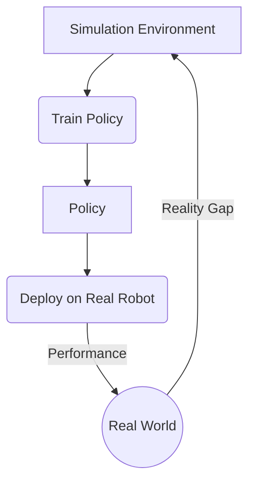

# A Reinforcement Learning Journey: From First Principles to Robotic Control

How can we teach a machine to perform a complex task, like riding a bike or mastering a game, without providing explicit instructions for every possible situation? This is the fundamental question that reinforcement learning (RL) seeks to answer. Unlike other machine learning paradigms that rely on static datasets, RL is about learning through active interaction with an environment. The agent, or decision-maker, learns by taking actions and observing the consequences, guided only by a sparse signal we call "reward." Its goal is to develop a strategy, or "policy," that maximizes its cumulative reward over time.

This learning process presents a unique and difficult challenge: the trade-off between exploration and exploitation. The agent must exploit what it already knows to gain rewards, but it must also explore new, untried actions to discover potentially better strategies. Furthermore, the consequences of an action might not be apparent until many steps later, a problem known as credit assignment.

This article documents my self-directed study of this field, structured as a series of key learnings from foundational papers and algorithms. My journey revealed a clear progression of ideas:

- It began with **formalizing the problem** using the language of mathematics to define states, actions, and rewards.
- It then moved to the core of modern RL: **direct policy optimization**, and the series of innovations required to make it stable, from baselines to trust regions.
- This theoretical foundation enabled an understanding of **state-of-the-art practical algorithms** like PPO and TD3, which solve critical issues like instability and overestimation.
- Finally, applying these algorithms to robotics forced a shift in perspective from pure algorithms to **holistic systems thinking**, where the real-world challenges of engineering and integration come to the forefront.

What follows is a technical narrative of that journey, from first principles to the complex systems required for robotic control.

## Phase 1: Formalizing the Problem

The first step was to move beyond the abstract idea of "learning from experience" and adopt the formal language of mathematics.

### The Markov Decision Process (MDP)

**The Logic:** Before an agent can learn, its world must be defined. We need a language to describe the environment, the choices the agent can make, and the goals it should pursue. The **Markov Decision Process (MDP)** provides this language. It assumes that the future is only dependent on the present state, not the past (the Markov Property), which simplifies the problem immensely.

**The Math:** The MDP is a tuple $(S, A, P, R, \gamma)$, defining:
- $S$: A set of states.
- $A$: A set of actions.
- $P(s'|s, a)$: The probability of transitioning to state $s'$ from state $s$ after taking action $a$.
- $R(s, a, s')$: The reward received after the transition.
- $\gamma$: A discount factor that prioritizes immediate rewards.

The agent's goal is to learn a policy $\pi(a|s)$ that maximizes the expected discounted return, $J(\pi)$.

$$
J(\pi) = \mathbb{E}_{\tau \sim \pi} \left[ \sum_{t=0}^T \gamma^t r_t \right]
$$

This objective function is the guiding light for all subsequent algorithms. It defines what "good" behavior is and provides a metric to optimize.

## Phase 2: The Rise of Policy Gradients

While value-based methods like Q-learning are fundamental, my journey focused on policy-based methods, which optimize the policy's parameters directly.

### Learning 1: The Policy Gradient Theorem (REINFORCE)

**The Logic:** How can we teach an agent to prefer good actions over bad ones? The most direct way is to "reinforce" behaviors that lead to good outcomes. If a sequence of actions results in a high total reward, we should increase the probability of taking those specific actions in those specific states again. This is the core intuition behind policy gradients.

**The Math:** The **Policy Gradient Theorem** (Sutton et al., 2000) provides a way to compute the gradient of the expected return with respect to the policy parameters $\theta$. The resulting algorithm, REINFORCE, updates the policy by pushing it in the direction of the gradient.

$$
\nabla_\theta J(\pi_\theta)
  = \mathbb{E}_{\tau \sim \pi_\theta} \left[ \sum_{t=0}^T
      \nabla_\theta \log \pi_\theta(a_t \mid s_t)\, R(\tau)
    \right]
$$

**Takeaway:** We can directly optimize the policy by increasing the log-probability of actions, scaled by the total reward of the trajectory they belong to. However, this approach is incredibly noisy. Every action in a successful trajectory is reinforced, even the ones that were mistakes. This leads to very high variance and unstable learning.

### Learning 2: Variance Reduction with Baselines and Advantage

**The Logic:** Instead of asking "was the outcome of this trajectory good?", it's more effective to ask "was the outcome of this action better than expected?". If an action leads to a return of 100, but we expected a return of 99, it was only slightly better than average. If we expected a return of -50, it was exceptionally good. This relative measure, the **Advantage**, is a much cleaner learning signal.

**The Math:** To achieve this, we introduce a state-dependent **baseline**, $b(s_t)$, which is typically the state-value function $V^\pi(s_t)$. The policy gradient is modified to use the **Advantage Function**, $A^\pi(s_t, a_t) = Q^\pi(s_t, a_t) - V^\pi(s_t)$, which can be estimated with $\hat{A}_t = R_t - V(s_t)$.

**Takeaway:** Using the advantage function dramatically reduces the variance of the policy gradient without changing its expected value. This is a foundational concept for all modern actor-critic algorithms, which learn both a policy (the actor) and a value function/baseline (the critic).

### Learning 3: The Danger of Large Steps (TRPO)

**The Logic:** In deep learning, we take small steps in the direction of the gradient. But in RL, a seemingly small change in the policy's parameters can lead to a catastrophic drop in performance. How can we take the largest possible step to speed up learning, without risking collapse? The answer is to constrain how much the policy's *behavior* can change, rather than its parameters.

**The Math:** **Trust Region Policy Optimization (TRPO)** (Schulman et al., 2015) formalizes this. It maximizes a surrogate objective function (which approximates the expected return) subject to a constraint on the average KL-divergence between the old and new policies.

$$
\max_\theta \;
\mathbb{E}_{s \sim \pi_{\theta_{\text{old}}}} \left[
  \frac{\pi_\theta(a \mid s)}{\pi_{\theta_{\text{old}}}(a \mid s)}
  \,\hat{A}_{\theta_{\text{old}}}(s,a)
\right]
\quad \text{subject to} \quad
\bar{D}_{\mathrm{KL}}\!\big(\pi_{\theta_{\text{old}}} \,\|\, \pi_\theta\big)
\le \delta
$$

**Takeaway:** Constraining the KL-divergence ensures that the new policy remains in a "trust region" around the old one, leading to stable, monotonic improvements. However, the algorithm is a second-order method and is complex to implement.

### Learning 4: Better Advantage Estimation (GAE)

**The Logic:** The quality of our advantage estimate is critical. A simple one-step TD error is low variance but can be very biased. A full Monte Carlo return is unbiased but has high variance. There must be a way to balance the two.

**The Math:** **Generalized Advantage Estimation (GAE)** (Schulman et al., 2015) provides an elegant solution. It computes the advantage as an exponentially-weighted sum of TD errors, controlled by a parameter $\lambda \in [0, 1]$.

$$
\hat{A}^{\text{GAE}(\gamma, \lambda)}_t =
\sum_{l=0}^{\infty} (\gamma \lambda)^l \delta_{t+l}
\quad \text{where} \quad
\delta_{t+l} = r_{t+l} + \gamma V(s_{t+l+1}) - V(s_{t+l})
$$

When $\lambda=0$, this is the simple TD error (high bias, low variance). When $\lambda=1$, it is the Monte Carlo estimate (low bias, high variance).

**Takeaway:** GAE provides a tunable knob to control the bias-variance trade-off in the advantage estimate, which has become a standard component in high-performance policy gradient implementations.

## Phase 3: Practical, State-of-the-Art Algorithms

This phase was about implementing and understanding the algorithms that dominate modern RL research.

### Learning 5: Simplifying Trust Regions (PPO)

**The Logic:** TRPO is powerful but computationally expensive. Can we get the same stability benefits with a simpler algorithm that only uses first-order gradients? **Proximal Policy Optimization (PPO)** (Schulman et al., 2017) does exactly this. Instead of a hard constraint, it uses a penalty to discourage the policy from changing too much.

**The Math:** The key is the **clipped surrogate objective**. It clips the probability ratio $r_t(\theta) = \frac{\pi_\theta(a_t|s_t)}{\pi_{\theta_{old}}(a_t|s_t)}$ to prevent it from moving outside a small interval $[1-\epsilon, 1+\epsilon]$.

$$
L^{\text{CLIP}}(\theta)
= \hat{\mathbb{E}}_t \left[
  \min\Big(
    r_t(\theta)\,\hat{A}_t,\;
    \mathrm{clip}\big(r_t(\theta), 1-\epsilon, 1+\epsilon\big)\,\hat{A}_t
  \Big)
\right]
$$

If the advantage $\hat{A}_t$ is positive, the objective increases with the ratio, but the `min` function prevents it from getting too large. If the advantage is negative, the objective decreases, but the clipping prevents the update from being excessively large.

**Takeaway:** PPO provides a first-order, easy-to-implement algorithm that captures the stability and reliability of TRPO, making it a default choice for many RL problems.

### Learning 6: Off-Policy Continuous Control (DDPG)

**The Logic:** On-policy methods are sample-inefficient because they throw away old data. For continuous control (like robotics), this is wasteful. **Deep Deterministic Policy Gradient (DDPG)** (Lillicrap et al., 2015) uses a replay buffer of past experiences to learn "off-policy." It learns a deterministic actor policy (which gives a precise action, not a probability) and a critic that estimates the Q-value of that action.

**Takeaway:** Off-policy learning with a replay buffer dramatically improves sample efficiency. However, DDPG is notoriously unstable and sensitive to hyperparameters, largely because the critic systematically overestimates Q-values, leading the actor to exploit non-existent advantages.

### Learning 7: Stabilizing Actor-Critics (TD3)

**The Logic:** If DDPG is unstable because it trusts a single, optimistic critic, why not use two critics and trust the more pessimistic one? And if the actor is learning too quickly from a noisy critic signal, why not slow it down? These are the core ideas behind TD3.

**The Math & Methods:** **Twin Delayed DDPG (TD3)** (Fujimoto et al., 2018) makes three specific fixes to DDPG:
1.  **Clipped Double Q-Learning:** It learns two Q-functions (the "twins") and uses the minimum of the two Q-values in the Bellman target. This helps mitigate overestimation.
2.  **Delayed Policy Updates:** The policy and target networks are updated less frequently than the value network, giving the critic time to converge to a better estimate before the actor uses it.
3.  **Target Policy Smoothing:** Small amounts of noise are added to the target action during critic updates. This creates a smoother Q-value landscape and makes the policy more robust.

The practical impact is profound. The videos below show a cheetah agent's progress, illustrating the difference between an unstable early algorithm and a robust, well-trained policy.

<video controls>
  <source src="/assets/blog/Reinforcement_Learning/cheetah_epoch1.mp4" type="video/mp4">
</video>
<video controls>
  <source src="/assets/blog/Reinforcement_Learning/cheetah_epoch3.mp4" type="video/mp4">
</video>

**Takeaway:** The stability of modern actor-critic algorithms comes from carefully identifying and addressing specific sources of error, such as overestimation bias in the critic.

## Phase 4: The Shift to Systems Thinking in Robotics

The final phase of my journey was applying these algorithms to robotics simulation in **MuJoCo**. This is where abstract theory collides with the messy reality of physical systems. The focus shifted from pure algorithmic improvements to a more holistic, systems-level approach.

The key challenges were no longer just about optimization, but about engineering:
-   **Reward Shaping:** In robotics, rewards are often sparse (e.g., a single +1 for task completion). This is insufficient for learning. I had to engineer dense reward functions that guided the agent towards the goal without creating unintended, "hacked" behaviors.
-   **The Sim-to-Real Gap:** A policy trained in a perfect simulation will often fail in the real world due to subtle differences in friction, mass, and sensor noise. This is a central problem in modern robotics.
-   **System Integration:** The RL algorithm is just one part of a larger system that includes the simulator, the robot model (MJCF), sensors, and actuators. Success requires a holistic view.

This final phase was a crucial lesson in engineering pragmatism. It demonstrated that while a deep understanding of the theory is essential, building functional autonomous agents is equally a challenge of system design and careful implementation.

